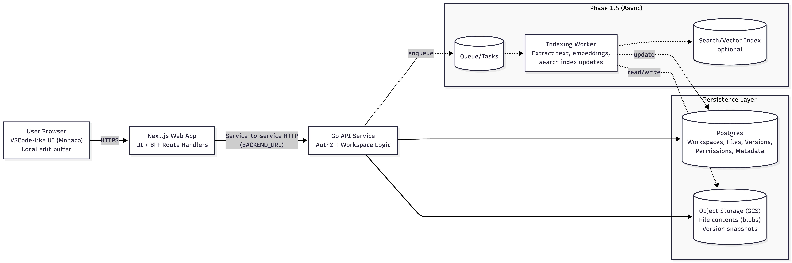

# Backend Architecture & Layout

## File System Architecture



**Note: We will omit phase 1.5 for now**

```bash
backend/
  cmd/
    api/                 # main entrypoint
      main.go
  internal/
    server/              # HTTP server setup (router, middleware, health)
      server.go
      middleware.go      # auth, request IDs, logging, rate limit
      errors.go          # consistent error responses
    config/              # env parsing / config structs
      config.go

    auth/                # authentication/authorization layer
      service.go
      middleware.go
      model.go           # user/session claims types

    workspace/           # DOMAIN: workspaces + tree
      handler.go         # HTTP handlers (thin)
      service.go         # business logic
      repo.go            # interface
      repo_postgres.go   # DB impl
      model.go           # workspace, node types

    files/               # DOMAIN: files + versions + content
      handler.go
      service.go
      repo.go
      repo_postgres.go
      storage.go         # interface for blob storage
      storage_gcs.go     # GCS impl
      model.go

    db/
      db.go              # connect, migrations hook
    telemetry/
      logger.go
      metrics.go

  migrations/            # SQL migrations
  Dockerfile
  go.mod
  go.sum
```
